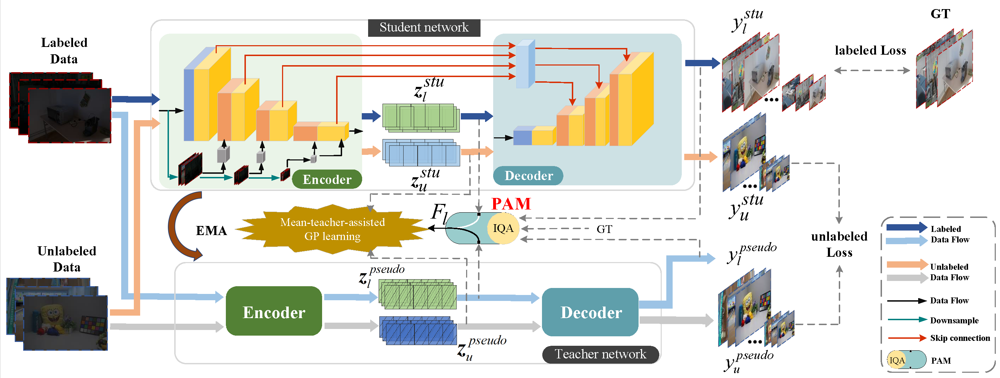

# LMT-GP: Combined Latent Mean-Teacher and Gaussian Process for Semi-supervised Low-light Image Enhancement

# Introduction
This is a Pytorch implement of “LMT-GP: Combined Latent Mean-Teacher and Gaussian Process for Semi-supervised Low-light Image Enhancement” (ECCV 2024)

we propose a semi-supervised method based on latent mean-teacher and Gaussian process, named LMT-GP. We first design a latent mean-teacher framework that integrates both labeled and unlabeled data, as well as their latent vectors, into model training. Meanwhile, we use a mean-teacher-assisted Gaussian process learning strategy to establish a connection between the latent and pseudo-latent vectors obtained from the labeled and unlabeled data. To guide the learning process, we utilize an assisted Gaussian process regression (GPR) loss function.  Furthermore, we design a pseudo-label adaptation module (PAM) to ensure the reliability of the network learning.



# Installation
Note that the core code "trainer.py" and "./loss/GP.py" is coming soon. 
## Installing Package
Clone this repository to local disk and install:
```
pip install -r requirements.txt
```
## Dataset Structure
```
    ├── data 
    |   ├── Labeled data # Training  
    |   |   ├── our485        
    |   |   |   ├── low   
    |   |   |   └── high
    |   ├── Unlabeled data # Training  
    |   |   ├── low       
    |   └── val  # Testing
    |   |   ├── low   
    |   |   └── high 
```
# Quick Start
## Train
```
python train.py
```
## Test
```
python test.py
```
# Acknowledgements
* Thanks to the creators of [IQA-pytorch](https://github.com/chaofengc/IQA-PyTorch) for the awesome work ❤️
* Thanks to the creators [Semi-UIR](https://github.com/Huang-ShiRui/Semi-UIR), [Syn2real](https://github.com/rajeevyasarla/Syn2Real), and [MIMO-UNet](https://github.com/chosj95/MIMO-UNet) for providing such elegant codes ❤️
